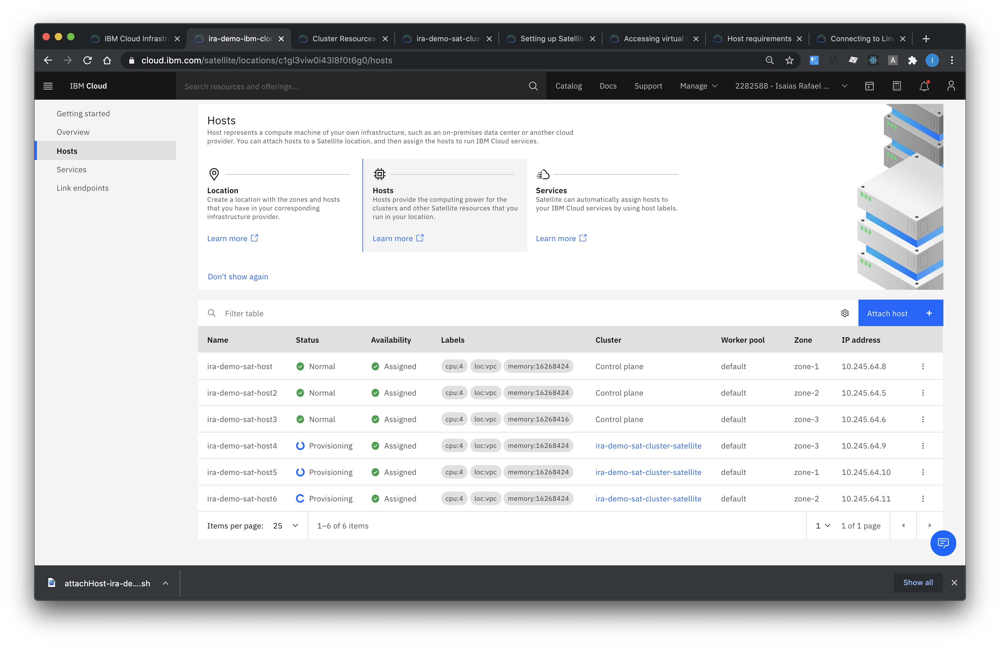

## Create Satellite Locations, Attach and Assign host

# Create Satellite Location

1. Go to Satellite -> Locations, then `Create Location` button.  Select `Manual setup`, enter the preferred Satellite location `Name`, select the appropriate location where the host will be `Manage from` (e.g. London or Washington DC). Confirm all information then proceed to `Create Location`. 

    

# Attach host

2. After successful creation of the Satellite location, proceed to the location, select `Host`, then `Attach host`.

    

3. Download the script, labels can be added before downloading the script. 

    

4. Copy the script from your local machine to the host

    ```
    scp -i <filepath_to_key_file> <filepath_to_script> <username>@<IP_address>:/tmp/attach.sh
    ```

5. Log in to the host

    ```
    ssh -i <filepath_to_key_file> <username>@<IP_address>
    ```

6. Run the script.  Add sudo for rootless login.

    ```
    nohup bash /tmp/attach.sh &
    ```

7. Monitor the progress of the registration script

    ```
    journalctl -f -u ibm-host-attach
    ```

8. Check if the host is added in the Satellite location

    

# Assign host

9. Select the `Ready` and `Unassigned` host to the Control plane. 

    

10. Assign host to the zone.

    

11. The host will be provisioned

    

