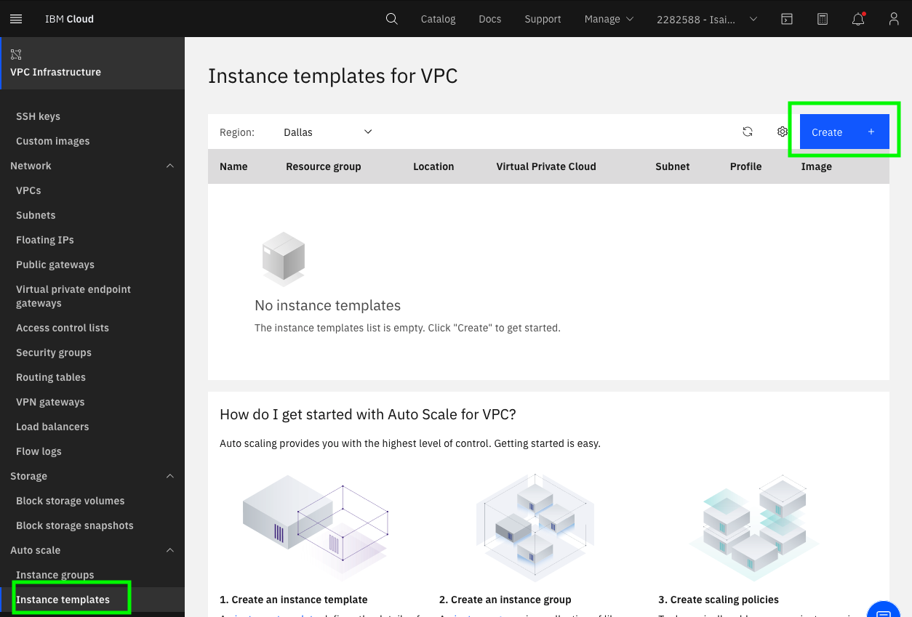
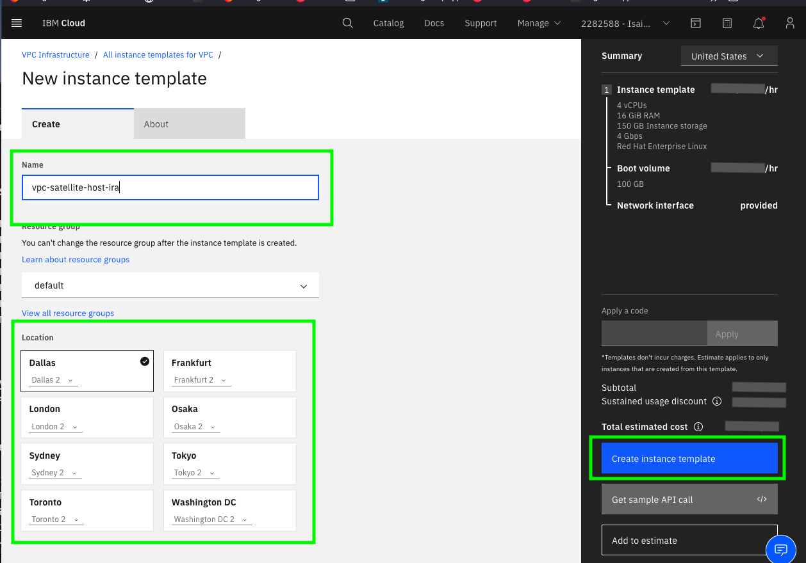

# Setup host via VPC Intance Group

## 1. Create Instance templace for VPC

a. Select `Instance templates for VPC` in VPC Infastructure 

b. Upload the attach script file and add the commands `subscription-manager refresh` and `subscription-manager repos --enable=*`

c.  Select **Location**, **Operating System Image** `RHEL 7`, then proceed to the **Create Instance template**

## 2. Create Intance Group

Select the **instance teamplate**, then choose **Static**, **Set instance group size** (enter 6 for minimum Satellite host) and **Create instance group**

This is the diplay after creating the instance group
 
 

 Check the status in the **Virtual server instances**, add the **Floating IP** for each hosts.

 

## 3. Check the Satellite location host

