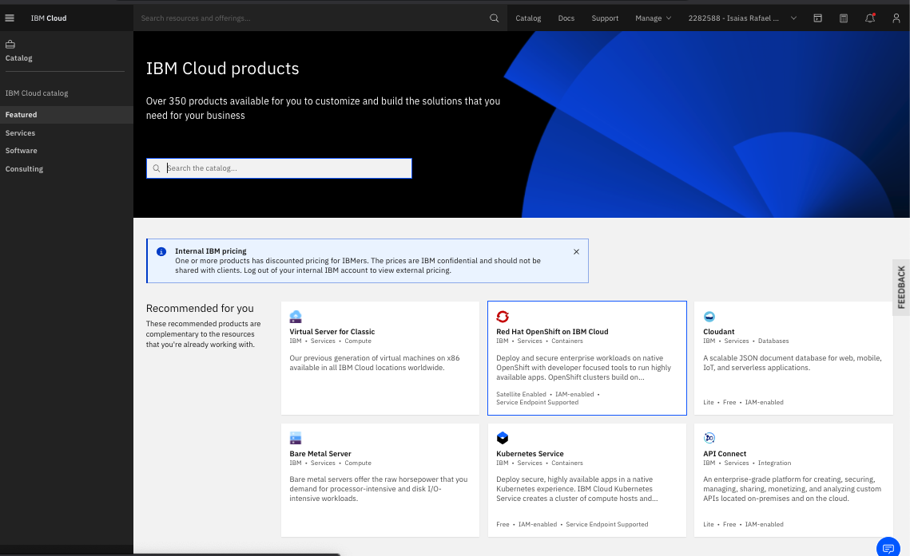
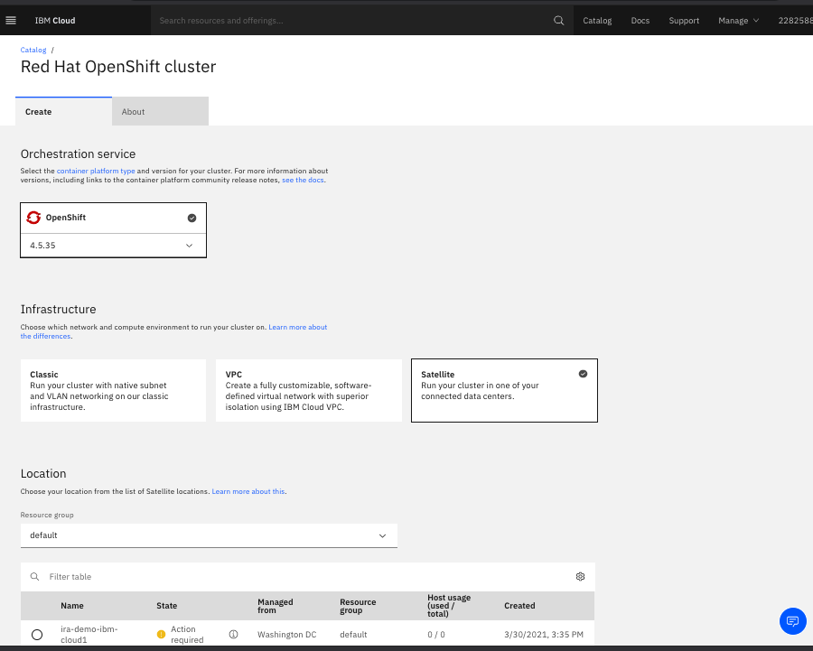
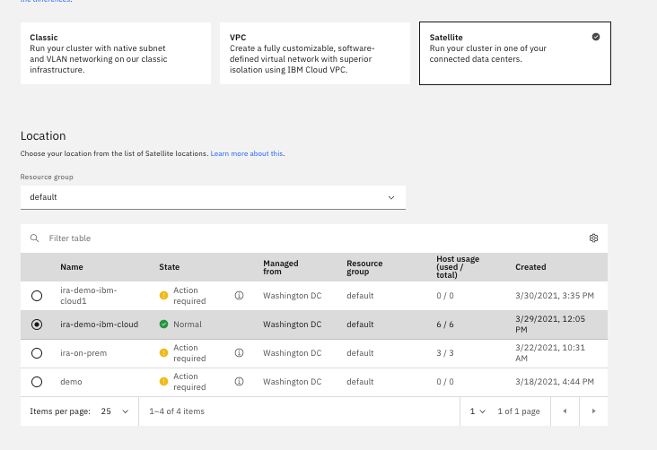
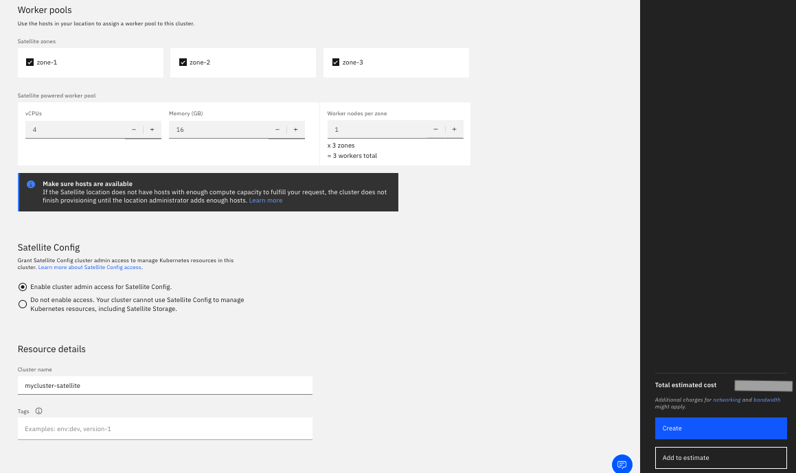

## Create Red Hat OpenShift Cluster on IBM Cloud

1. Select Red Hat OpenShift on IBM Cloud from the Catalog

    

2. To create Red Hat OpenShift Cluster using Satellite host, select Satellite in the Infrastructure.

    

3. Select the Satellite host location. Ensure the location state is **Normal** with minimum of 6 hosts. Three (3) hosts are required for the control plane and three (3) for the worker nodes.   Red Hat OpenShift requires minimum of 2 worker nodes however not recommended for production environment.

    

4. Finalize the cluster details to create the cluster

    * Select Worker pools. Three (3) Satellite zones are required for production environment, however, for test or demo two (2) Satellite zones can be used.
    * Select the appropriate Worker nodes per zone
    * Select **Enable cluster admin access for Satellite Config** in the **Satellite Config**
    * enter the desired **Cluster name**
    * click on the **Create** button to create the cluster

    
