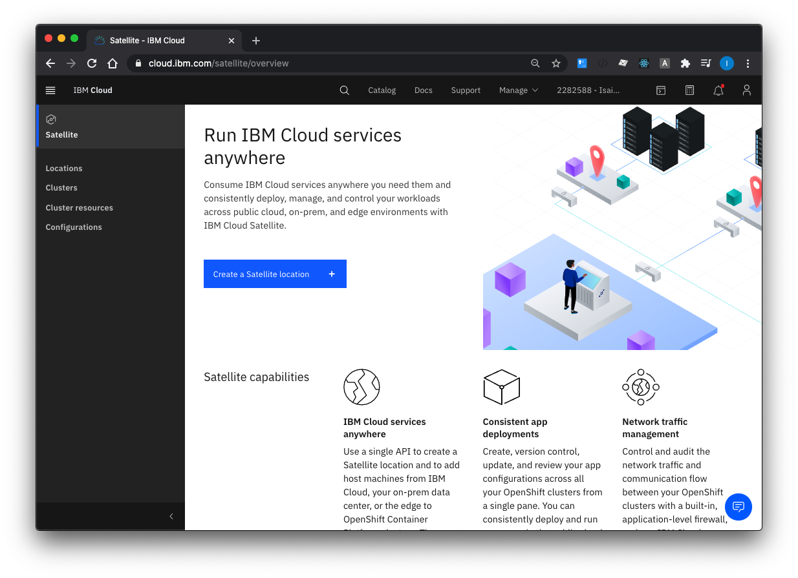
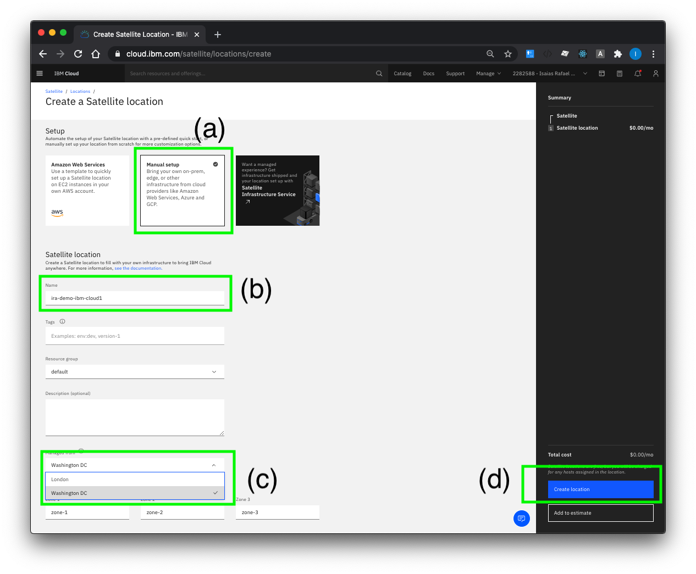
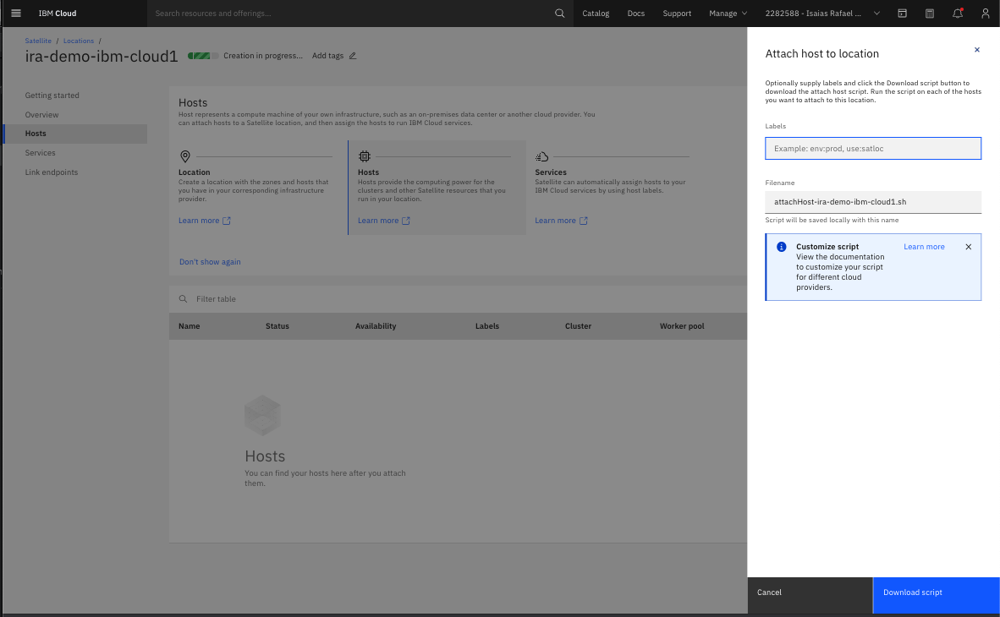
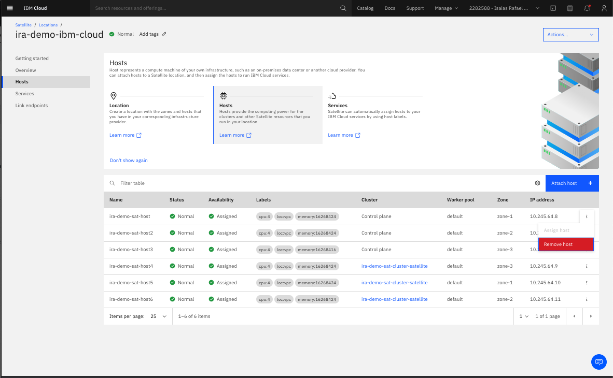

## Create a Satellite Location

1. Click on the Create a Satellite Location button

2. Enter the location details; (a) Select Manual Setup, (b) Name of the Location (ira-demo-ibm-cloud), (c) Select where the location is managed (Washington DC), (d) Click on the Create location button

3. After creating the location, next add hosts. To add host, download the script and run in host or upload in VPC setup. (see VPC setup)

4. Once all the host has been attached to the location. Assign host to Control plane and Zone-1, Zone-2, Zone-3. The rest of the unnassigned host will be assigned once the IBM Cloud serivce (OpenShift) is deployed.

