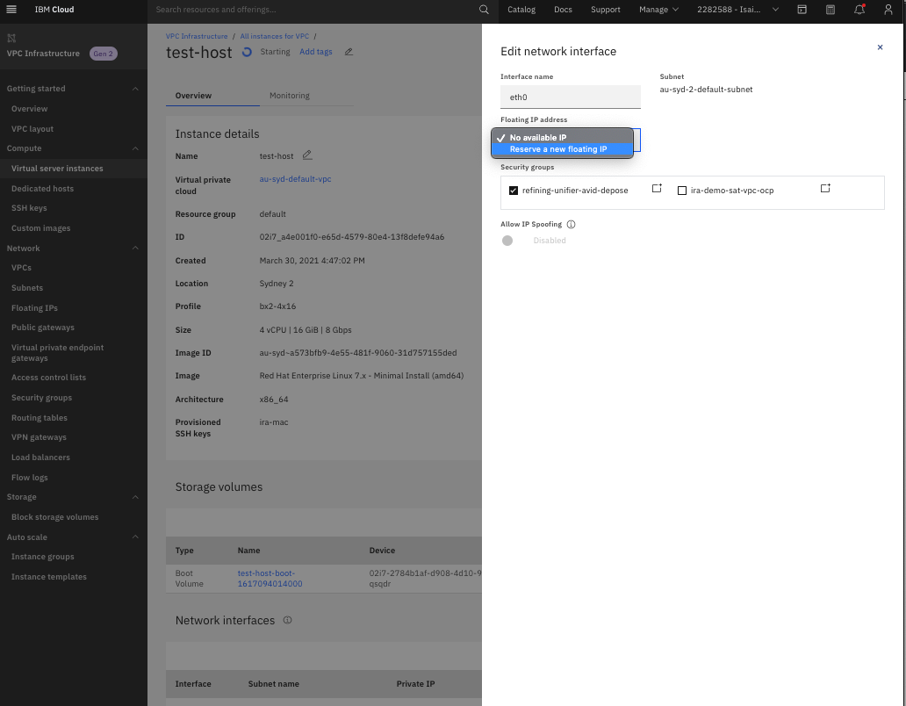

## Create Server Instance in IBM Virtual Private Cloud


1. Create new virtual server instance for VPC.

* Enter instance name (test-satellite), selection location (Sydney)
* Select Type of virtual server (Public).


2. Select Operating System. For Satellite select Red Hat Enterprise Linux 7.x - Minimal Install


3. Select Server Profile. Minimum Satellite requirement: 4 cores, 16GB memory, 100GB storage.


4. For manual configuration of server instance, upload SSH keys.  For automated setup, upload the attach host scripts in the Import user data.

For manual configuration via SSH, run the following commands before executing the attach host script. Or for automated setup, add the following CLI commands in the attach host script before uploading.

```
subscription-manager refresh
subscription-manager repos --enable rhel-server-rhscl-7-rpms
subscription-manager repos --enable rhel-7-server-optional-rpms
subscription-manager repos --enable rhel-7-server-rh-common-rpms
subscription-manager repos --enable rhel-7-server-supplementary-rpms
subscription-manager repos --enable rhel-7-server-extras-rpms
```


5. Once the setup is confirmed, click on the `Create virtual server instance`


6. After the creation of the server instances, select instances without Floating IP.


7. To add *Floating IP*, select the host and edit the corresponding Network interfaces, either select an existing IP address or Reserve a new floating IP.  Floating IP is required for external access, otherwise, VPN is required to access the instances using Private IP.



